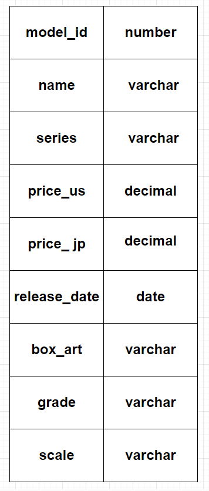

# Model Meister
## Christian Alexander

Model-Meister is a catalogue app for model kits that the user can add, edit or delete from their space that they want to build, have built, or are just their favorite!

Trello Board
- https://trello.com/b/XeFZt5Fu/model-meister

Render Deploy
- https://model-meister.onrender.com/kits/

## ERD

## Route Map

| Route name  | endpoint | method | Description                 |
| ----------- | -------- | ------ | --------------------------- |
| Index | /kits/   | GET    | Renders all models |
| Create | /kits/   | POST    | Adds a model to the database |
| Update | /kits/:id/   |  PUT   | Updates a model based on id |
| Delete | /kits/:id/   | DELETE   | Removes a model from the database |
| Show | /kits/:id/   | GET    | Renders a model based on id |
